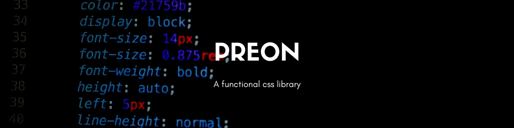

# Preon



Preons was created after stumbling across functional css and [Tachyons](https://tachyons.io/). Preons is based however on a rules.yml that you can define for your project to generate your Sass Preons.

## Quick Start

TBC as I work on the Preon theme.

## Generating Custom Functional CSS Stylesheets

```sh
npm install @preons/cli

preon --dist style.scss
```

### Options

| Option | |
|--------|-|
| --src  | Source rules file (optional) |
| --dist | Output file |

## The Rules File

A rules file requires the following basic structure:

```yaml
preons:
  rules:
    #
  classes:
    #
  breakpoints:
    #
```

### Rules

A rule is just an array of options. This can be colors, sizes in pixels, rems, ems; any value applied to a css style.

```yaml
color:
  black: "#282828"
  pink: "#e23b88"
  mustard: "#fbcf00"
```

### Classes

You then apply those rules to a css class for a single css style. Notice below, we assign our color rule to two classes. 1) to `.bg-` representing our `background-color` style, and 2) to `fill-` representing our `fill` style.

```yaml
- label: bg-
  css-property: background-color
  rule:
   - color
- label: fill-
  css-property: fill
  rule:
   - color
```

With the preonize function, it will create the following css:

```css
.bg-black { background-color: "#282828"}
.bg-pink { background-color: "#e23b88"}
.bg-mustard { background-color: "#fbcf00"}

.fill-black { fill: "#282828"}
.fill-pink { fill: "#e23b88"}
.fill-mustard { fill: "#fbcf00"}
```

### Breakpoints

Usually, sizes of things change as you go from mobile to desktop. So there is a breakpoints option. You can add a many breakpoints as you want.

> Note, every style will have a breakpoint version, and this will increase the size of your final css stylesheet.

```yaml
breakpoints:
  m: "only screen and (min-width: 768px)"
  l: "only screen and (min-width: 1024px)"
```

## The Preonize function

Under the hood, the preonize function takes a map of rules, for each breakpoint, then generates css for a particular css style.

```sh
@include preonize("h", height, $scaled, $breakpoints);
```

An example would be:

```
.h1 { height: 1rem }
.h2 { height: 2rem }

@media only screen and (min-width: 768px) {
    .h1-m { height: 1rem }
    .h2-m { height: 2rem }
}
```


## What is Functional CSS

It's an extremely modular approach to css. The main benefit for me, is that at some point, I don't have to write any more css. All the rules I need are completely defined.

As more modules and styles are created by the designer, I simply need to code it in the HTML. That leads to the second benefit. It's easy to reuse styles and tweak them on a case-by-case basis. This means more interesting sites that don't have to fit stock components out of fear of BEM-bloat.

Actually, that last point isn't trivial. Designers constantly break their own rules so that websites look good in their designs. Sometimes they have text in a 4/12 width block left aligned. A very similar looking module on the same page has 5/12 block. Writing reusable components with modifiers becomes painful when they deviate from rules we developers try to apply to prevent the css from going wild.

Functional css helps be more flexible and align ourselves with designers closely.

### Clap backs

Okay, these are not real clap backs but here are some objections to functional css and my responses:

### Is this production ready?

Ish...

There are a few things that would make this library better. Docs are one. Standardising the naming conventions is another. So it's not 100% there yet, but I'm currently, working on one site and I'm happy with it.

I also use an archaic form of Preons to create [Pixelex Aspect's](https://pixelexaspect.com/) [nuxt](https://nuxtjs.org/) website.

### Isn't it Bootstrap?

No.

As in; no. Functional css isn't a set of defined modules. Functional css is like a subatomic part rather than the atom. So you should be able to say, this component, at this break point, has 'abc' font, but at the next break point, has another font?

```html
<button class="br-50 pa1 pa2-m fs1 fs3-l bg-green">
    Click me
</button>
```

Bootstrap, as fantastic as it is, encompasses all the rules for a particular module so you cannot piecemeal custom styles together without writing more css.

```html
<button class="btn btn--primary">
    Click me
</button>
```

### Do I hate Bootstrap?

No. Hate is a strong word. Use it for things like marmite or something.

### Isn't it difficult to read?

I think it is, until you learn it. Tachyon's has a great [cheat sheet](https://roperzh.github.io/tachyons-cheatsheet/). I highly recommend having a cheatsheet to assist with functional libraries.

### So functional css is trying to make BEM irrelevant?

IMHO, functional css isn't diametrically opposed to BEM. In fact, there's nothing wrong with defining the rules of a styleguide with functional css, but for a cleaner HTML syntax (if it makes one feel better and less hacky), you can combine functional styles into defined components.

> Here's a SCSS example

```scss
.button {
    @extend .fs1;
    @extend .fs2-m;
    @extend .bg-grey;
    @extend .white;
    @extend .pa1;
    @extend .pa2-m;

    &--primary {
        @extend .bg-blue;
    }
}
```

```html
<button class="button button--primary">
    Click me
</button>
```

### Contributing

There's plenty still to do:

* Generating Preon user docs using the CLI
* Generating a cheatsheet
* Creating a few example styled HTML components
* Creating the default Preon theme

### Changelog

TBC